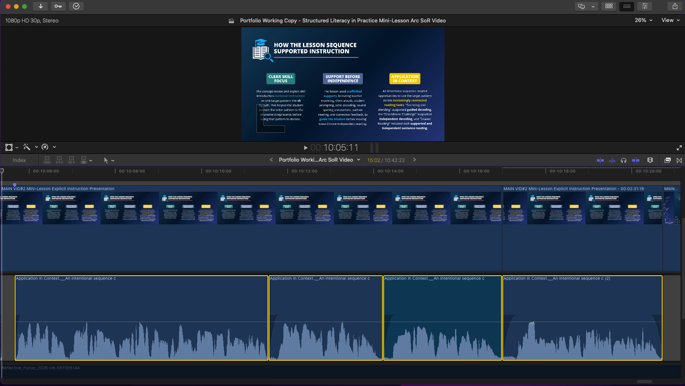
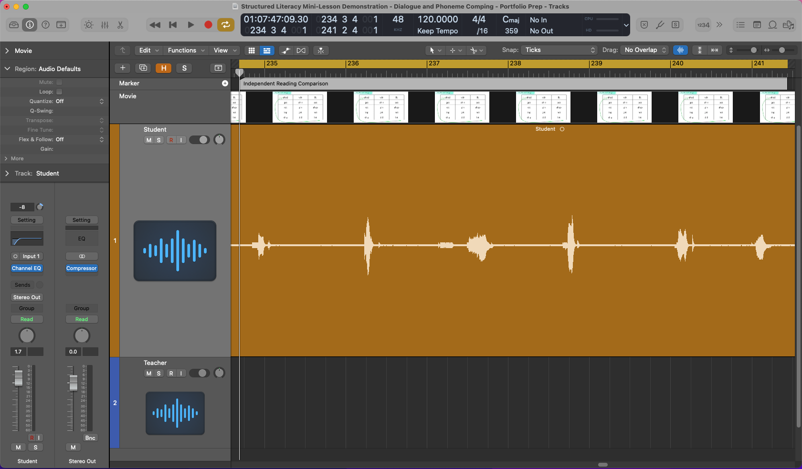

# Structured Literacy Voice Production

This audio-production case study documents how I combined ElevenLabs-generated narration with human-recorded instructional dialogue, voice editing, and audiovisual post-production to produce a structured literacy training video commissioned by San Juan College.

The featured project, *Structured Literacy in Practice: Demonstrating a Lesson Sequence (Mini-Lesson Format)*, is one of two Science of Reading videos developed for the San Juan College Teacher Education Department’s educator-preparation resource library.

## Project Context

**Client:** San Juan College Teacher Education Department 
**Role:** Instructional Video Developer – Educator Preparation (Contract) 
**Project period:** March–June 2026 

I was selected by the San Juan College Teacher Education Department to develop two instructional videos for its educator preparation resource library. The videos were created to support the preparation of future educators by modeling effective instructional practices in structured literacy and evidence-based reading instruction.

The video featured in this case study demonstrates the sequence of a structured literacy mini-lesson, including review, explicit modeling, guided practice, corrective feedback, and application.

My responsibilities included instructional planning, script development, voice production, audio editing, visual production, synchronization, quality review, and final delivery.

## Project Outcome

Both commissioned videos were completed, reviewed, and accepted by San Juan College for its educator-preparation resource library.

## Featured Audio Editing Comparisons

The following playable comparisons document specific editing and processing decisions from the completed production.

### [TTS Narration Editing Comparison →](https://anthonymatosaudio.github.io/structured-literacy-voice-production/tts-narration-editing-comparison.html)

  

**Playable before-and-after narration** with Final Cut Pro screenshots showing pacing refinement, breath editing, and alternate-generation assembly.

### [Multi-Stage Dialogue Cleanup Comparison →](https://anthonymatosaudio.github.io/structured-literacy-voice-production/multi-stage-dialogue-cleanup-comparison.html)

  

**Playable three-stage dialogue comparison** with Logic Pro and Final Cut Pro screenshots showing high-pass filtering, light bus compression, and selective volume automation.

## Voice Production Workflow

### ElevenLabs narration

I used my ElevenLabs Professional Voice Clone to generate much of the instructional narration.

The production process involved:

* Generating multiple versions of lines when delivery or emphasis needed refinement
* Comparing takes for pronunciation, pacing, prosody, clarity, and naturalness
* Selecting useful phrases and segments through the Final Cut Pro media browser
* Assembling the preferred performances on the timeline
* Adjusting pauses and timing to support instructional pacing
* Blending alternate generations when individual words, sounds, or syllables required different emphasis
* Using fades and volume automation to maintain natural transitions and consistent levels
* Reducing distracting breaths, mouth noises, and other generated artifacts
* Synchronizing the completed narration with graphics and instructional demonstrations

See the [Voice-Clone Source Recording and Performance Notes](docs/voice-clone-source-recording-and-performance-notes.md) for additional detail on source capture, instructional delivery, script selection, model testing, and post-production.

I also used ElevenLabs to create the short educational music audio tag used at the beginning and end of the video, along with a subtle ambient musical sound bed.

### Human-recorded lesson dialogue

The lesson included isolated phonemes and pronunciation demonstrations that required a high degree of instructional precision.

After testing several text-to-speech approaches, I decided that recording this portion with human voices would produce a clearer and more dependable result. I performed the teacher role, while a colleague recorded the student responses.

I edited the human-recorded dialogue in Logic Pro by selecting and combining takes, refining timing and continuity between edits, and trimming excessive breaths and mouth noises. I applied a high-pass (low-cut) filter to both the teacher and student channel strips to remove unnecessary low-frequency rumble and buildup while leaving the rest of the tonal balance largely unchanged.

To give the assembled dialogue a more controlled and consistent presentation, I applied light compression on the Logic Pro master bus. The compression reduced level variation, but it also made some remaining low-level mouth noises and breaths between phonemes more noticeable. After importing the processed dialogue into Final Cut Pro, I used localized volume automation to attenuate those artifacts while preserving the intended phonemes, timing, and synchronization.

## Key Production Decision

The Professional Voice Clone worked well for general instructional narration, but isolated phonemes were not consistently reliable enough for every part of the lesson.

Rather than forcing the same production method across the entire video, I used each approach where it was most effective: ElevenLabs for the broader narration and human recording for the phoneme-sensitive teacher-and-student sequence.

This allowed the finished production to retain the efficiency and consistency of generated narration without compromising pronunciation accuracy or instructional clarity.

## Voice Editing and Quality Review

My review process focused on whether each segment supported the instructional purpose of the video—not only whether it was technically clean.

The main evaluation criteria included:

* Pronunciation and phonemic accuracy
* Natural pacing and pause length
* Prosody and instructional emphasis
* Breath and mouth-noise control
* Continuity between assembled performances
* Level consistency
* Synchronization with the visual lesson
* Overall clarity and naturalness

See the [Voice Production Quality Review Framework](docs/voice-production-quality-review-framework.md) for the review criteria used across voice performance, editing, technical quality, instructional clarity, and final delivery.

## Tools Used

* ElevenLabs
* Final Cut Pro
* Logic Pro

## Portfolio Links

- [Structured Literacy in Practice: Demonstrating a Lesson Sequence (Mini-Lesson Format)](https://youtu.be/Nal13b7Ncxs)
- [Explicit Instruction in Structured Literacy](https://youtu.be/CZoKI_4M-xM)
- [LinkedIn Profile](https://www.linkedin.com/in/anthonymatosaudio/)

## Planned Additions

This case study will be expanded with selected editing examples and production notes documenting key decisions in voice-clone recording, narration assembly, dialogue editing, cleanup, and final audiovisual integration.

## Portfolio Note

This is an independent portfolio case study documenting my production process. It does not imply endorsement by San Juan College.
